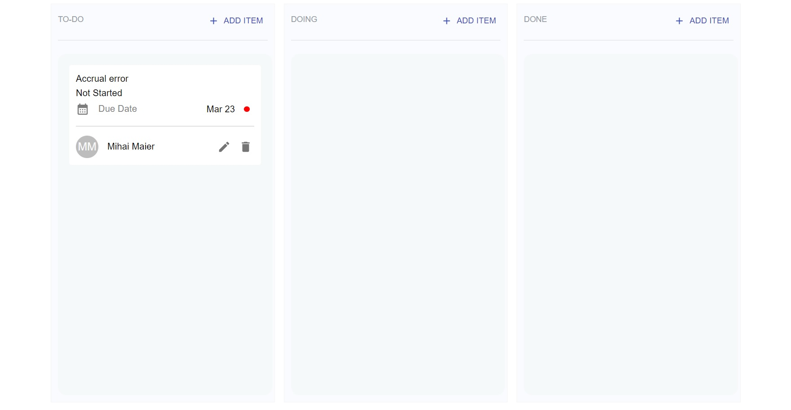

<h1 align="center">Kanban board</h1>
 - is one of the tools that can be used to implement kanban to manage work at a personal or organizational level.

## Features ✨

- Drag & drop tasks
- CRUD for tasks, labels & columns
- Edit task descriptions
- Add sub-task

:satellite: Live Demo: [Click me!](https://mikemayster.github.io/react-kanban-board/)



## Development setup 🛠

Steps to locally setup development after cloning the project.

### Step 1 - Dependencies

You will need:

- [node](https://nodejs.org/)

Please install them if you don't have them already.

### Step 2 - Install packages

If you are using npm, run from the root of the repository:

```sh
npm install --legacy-peer-deps
```

### Step 3 - Run an app

Once the dependencies are installed, you can run the app:

```sh
cd react-kanban-board
yarn start
# or
npm start
```

Your browser should open up to a running app.

### :rocket: Deploy

1. Open `package.json` and at the homepage property add the value in this format: `https://{username}.github.io/{repo-name}`
2. A predeploy property and a deploy property to the scripts object has been added.
3. Run `npm run deploy` and push the React app to the GitHub repository
4. Follow the deployment process on Github Actions
